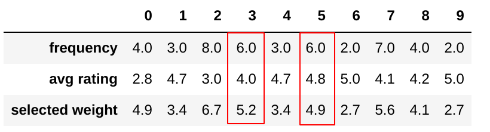

## Idea for improving BPR

#### Limitation for BPR

While for rating that can identify like and dislike, the positive sample item $$j$$ and negative sample item $$l$$ should be carefully selected. For example, if user rated item **A** with rate 1, which indicated that the user does not like it. It is hardly to say that the user will give **A** a higher rating than all other items that he or she do not rate. **Therefore, rating an item does not guarantee the user like it.**

One the other hand, user do not rated one item mainly owning to the following reasons:

1. New item or poor promoted item, user even do not know this item exists.

2. Items user no interest on the item. Since mostly of the rating required purchase before them. Some items will never be rated if user never buy.

According to the reasons above, an user not rating an item does not indicate he or she does not like it. The BPR algorithm is likely to consider those new items that has never been rated by others as negative sample. That leads to a low Novelty and Diversity of the recommender system.

Weighted Bayesian Personalized Ranking ([WBPR](https://github.com/PreferredAI/cornac/blob/master/cornac/models/bpr/recom_wbpr.pyx)) selects the negative sample from those items that has been rated by other users. However, it still remains some limitation in comparing items based on the rating values. 

To briefly conclude, to improve the recommendation, there are 2 aspects:

1. Increase the confidence of positive and negative pairs.
2. Fully use the information among rating comparison.

The following will discussed a sampling method that is designed to modified Bayesian Personalized Ranking (MBPR), which is going to solve this problem by selecting the negative sample based on item frequency and  item average rating.

#### Negative Sampling

`true_threshold` is defined as the rating threshold that items with rate above it have high enough confidence to consider as users preference.

For the MBPR, for each user, the item without rating or with rating less than `true_threshold`  is considered as the negative sample. 

**Example:**

Assume user 2 rated item 669, 12038 and 2214 as 5, 1 and 4  respectively. Given `true_threshold == 3` and `num_neg == 4 ` The following is a the training sample for user 2 and positive item 669. 

1. For positive sample item 669, we label the other items that received a lower rating from user 2 as its negative sample, which are 12038 (rating 1) and 2214 (rating 4) in this case. 

2. If the positive sample items has rating above `true_threshold`, they will select another `num_neg` ( 4 in this case) negative samples from those item without rating from user 2.

*(Table: negative item samples for user 2, positive item 669, red box matches the rule 1. )*

We repeat the above operation for all items that rated for the user. That is, only items rated by user 2 are able to be the positive sample. 

The remaining negative sample will be selected based on the following:

where  $$fre_i$$ is the rating frequency of item i, and $$rating_i$$ is the average rating of item i. 

It is assume that user is more likely to heard about item with high rating frequency, since these items is more popular than others. And user is more likely to dislike those items with lower rank since they might be low quality items. The  0.75 and 1.25 are frequency factor and rating factors used to adjust the selected weight $$f(i)$$ for each item.

*(Table: sampling weight example for item 0 to 9)*

To summary, the idea of this negative sampling is that:

+ we want to increase the confidence of selecting correct positive and negative pairs. By selecting items with higher rating frequency and lower average rating will increase the confidence.
+ we want to keep the information of rating comparison.

#### Optimizing

**Objective function**

> $$u$$: user factors
>
> $$v$$: item factors
>
> $$j$$: positive sample item id
>
> $$l$$: negative sample item id

**Optimizer**

Considering the training speed and efficiency,  SGD are used for optimization.  **Different Learning rate schedule and momentum are tried and it turns out learning rate being `1e-5` and not applying momentum is the most efficient approach.**
$$
\begin{array}{l} 
u_{i k} \leftarrow u_{i k}-\alpha\left(\frac{1}{1+\exp \left\{\boldsymbol{u}_{i}^{T} \boldsymbol{v}_{j}-\boldsymbol{u}_{i}^{T} \boldsymbol{v}_{l}\right\}}\left(v_{l k}-v_{j k}\right)+\lambda \cdot u_{i k}\right) \\
v_{j k} \leftarrow v_{j k}-\alpha\left(\frac{1}{1+\exp \left\{\boldsymbol{u}_{i}^{T} \boldsymbol{v}_{j}-\boldsymbol{u}_{i}^{T} \boldsymbol{v}_{l}\right\}}\left(-u_{i k}\right)+\lambda \cdot v_{j k}\right) \\
v_{l k} \leftarrow v_{l k}-\alpha\left(\frac{1}{1+\exp \left\{\boldsymbol{u}_{i}^{T} \boldsymbol{v}_{j}-\boldsymbol{u}_{i}^{T} \boldsymbol{v}_{l}\right\}}\left(u_{i k}\right)+\lambda \cdot v_{l k}\right)
\end{array}
$$

#### Interpretation

*(picture: prediction consistency)*

The prediction of items for a same user is consistent to the rating. For same user, if the item A has greater rating than item B, then A should be predicted higher than B.

*(picture: relationship between `num_neg` and gap )*

There will be a gap between predictions of item with rating above `true_threshold` and those below `true_threshold`. Since the `true_threshold` is defined, 

As the `num_neg` increases, this gap increases.

Since increase the `true_threshold` will increase the confidence of selecting correct positive items, theoretically, it is expected that lower `true_threshold` value will generate a higher recall, which is also proofed in the test.

| true_threshold | num_neg | NCGD   | NCRR   | RECALL |
| -------------- | ------- | ------ | ------ | ------ |
| 5              | 5       | 0.0017 | 0.0007 | 0.0057 |
| 4              | 5       | 0.0019 | 0.0007 | 0.0062 |
| 3              | 5       | 0.0025 | 0.0010 | 0.0076 |

*(table: relationship between recall and `true_threshold`.)*

#### Evaluation

The best score on leader broad is generated by cornac BPR currently, which is 40.07 on average. The improved model do not outperform cornac BPR might owning to the following reason:

+ Negative sample selecting is not optimized.  In this project, the selected weight of negative sample has not been tuned.
+ Number of negative sample is not optimized. In this project,  only new `num_neg` values (2, 5, 10, 15, 25) is tested.  `num_neg` = 25 usually yields better.
+ Poor training speed. Since the code is implement in python and numpy only, it is expected to run much slowly than cornac BPR. This is also the reason that few hyper parameters are tuned in the project.

